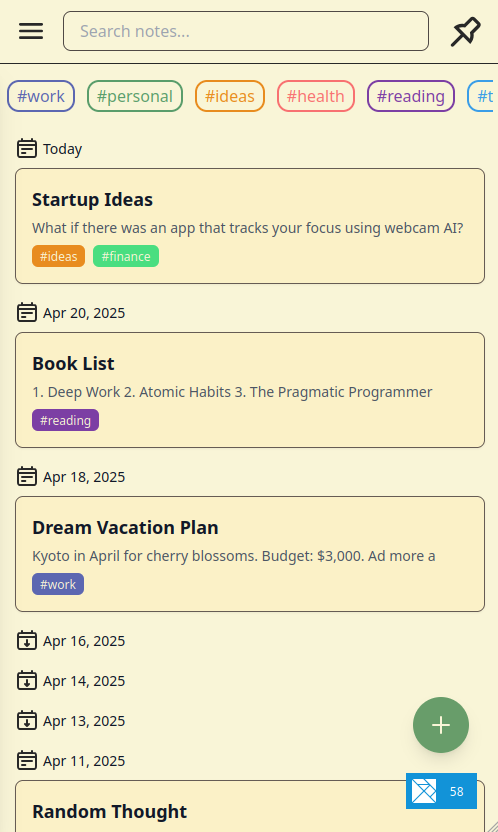
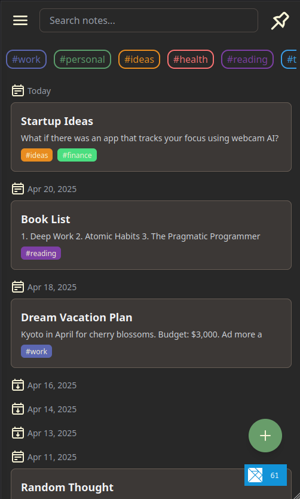

# Sift

**Note-taking is hard.**  I often have an idea — but capturing it quickly and
effortlessly? That’s surprisingly hard.

If I had pen and paper, I’d just jot it down. But paper isn’t scalable. And most
note-taking apps make you pause and think: *Where should this go? Work folder?
CS folder? Some tag or hierarchy?*

So I built **Sift** — a lightweight app that acts as a buffer between thought
and structure. One button. A blank note. A tag. Done.

Sift isn’t meant to replace your current note system. It’s meant to **bridge the
gap between inspiration and organization**, so you can just jot things down and
move on.

- *The app is designed for mobile use.*
- **Try it here**: [https://sift.mesnoy.com](https://sift.mesnoy.com)


## Features

* Quick note creation (title + body + tags)
* Tag-based organization — no folders 
* Tag suggestions with color-coded visual hints


## Screenshots

Light mode: 

Dark mode: 


## Installation

You’ll need [Elm](https://elm-lang.org/) and [Elm Land](https://elm.land/)
installed globally:

```sh
npm install -g elm elm-land
```

Clone the repo and run the dev server:

```sh
git clone https://github.com/omer-biz/sift.git
cd sift
npm install
elm-land server
```

Then open your browser to [http://localhost:1234](http://localhost:1234)

## Disclaimer

This is an experiment. Only the core features are complete, and there may be
bugs or unfinished edges.  I'm sharing it anyway — because maybe this small
thing is useful to someone else too.

The experiment might fail — and if it does, I want that to be known as well.

Feedback is always welcome. 
